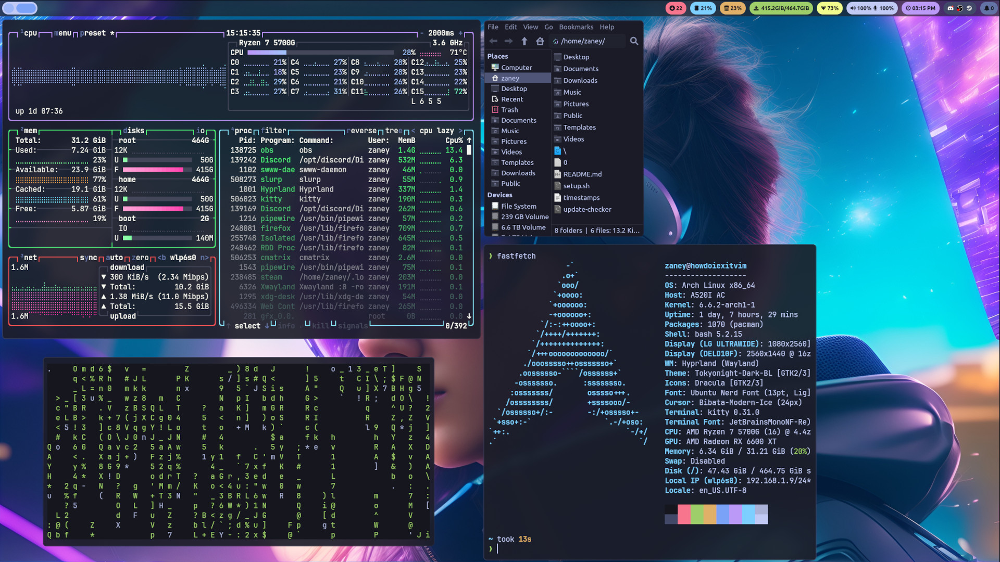

# Useful Links
1. [Theme I Currently Use](.themes/Tokyonight-Dark-BL)
2. [Script Directory](.local/bin)
3. [Hyprland Config](.config/hypr/hyprland.conf)
4. [Cursor Theme](.icons/Bibata-Modern-Ice)
5. [My Website](https://zaney.org/)

# About My System

This repository is my personal dotfiles. Dotfiles are the files responsible for customization on your Unix(-like) system. This exists so that anyone can see how I have customized my system. The customization and configuration files on Unix(-like) systems are referred to are dotfiles, because typically they begin with a period.

I currenty run Arch with Hyprland. I couldn't recommend it enough. I am currently using this setup on my laptop (Intel OEM Whitebook) & Ryzen desktop.

I do want to point out that my config was **not** tailored to suit a large number of people originally. However, I have put a lot of work into automating a lot of the setup process if you would like to repliate my system configuration.

## Programs That I Use
- [hyprland](.config/hypr) (Window Manager/Compositor)
- [swww](https://github.com/Horus645/swww) (Wallpaper)
- [tofi](.config/tofi) (Program Launcher)
- [kitty](.config/kitty) (Terminal)
- [thunar](https://docs.xfce.org/xfce/thunar/start) (File Manager)
- [mpv](https://mpv.io/) (Video Player)
- [firefox](https://www.mozilla.org/en-US/firefox/new/) (Web Browsing)
- [discord](https://github.com/SpacingBat3/WebCord) (Rec Podcasts & Fun)
- [kdenlive](https://kdenlive.org/en/) (Video Editing)
- [btop](.config/btop) (System Monitoring)
- [vim](.vimrc) (Text Editor / IDE)
- [swaync](.config/swaync) (Notifications)
- [pavucontrol](https://freedesktop.org/software/pulseaudio/pavucontrol/) (Audio Control)
- [bash](https://www.gnu.org/software/bash/) (Shell)
- [obs studio](https://obsproject.com/) (Streaming/Recording Software)
- [blender](https://www.blender.org/) (3D Modeling)
- [steam](https://store.steampowered.com/) (Most Gaming)
- [0 A.D](https://play0ad.com/) (Best Open Source Game)
- qt5ct,Kvantum,nwg-look (Theming)

## Features

1. Great wallpapers that come with the config can match with many different dark or light colorschemes. It also is high resolution making it fine for any kind of monitor config you throw at it. Not to mention its a sleek, modern, cyberpunk aesthetic that just screams beauty.
2. Using waybar and tofi for the top bar and program launcher gives a sleek full featured user experience with very little performance impact. The bar is setup for laptops with wifi and battery modules, including all that one would expect from a bar. The tofi and waybar configuration is designed to give you a dwm feel without having to patch dwm, dmenu, etc! 😉
3. Neofetch is a great program, however it can be slow. So this setup includes an alias to the program fastfetch. Which is meant to be a faster alternative to neofetch.
4. All of the theming comes together with the dotfiles. If you like the theme I use for programs no need to set them all up individually. Besides how could you not love 🧛 Dracula & now 🌆 Tokyonight? 
5. Many great scripts are included. Like the script for packagecount in the bar, the emoji selection script, and many more. 
6. Not only do you have great window animations, but the borders for your windows are an animated gradient. 

### Vim Configuration

I needed to put this in its own little section just because of how proud I am of this vimrc. **This is a fully automated Vim configuration file.** It will automatically download vim-plug, the plugins and then install all of the language servers in the config file. 

I think you'll find a moderately slim Vim configuration with all the important features of any text editor that you'd want to code or configure the day away in. 

Shortcuts:
- Ctrl + f = Toggles NERDtree
- Press t on a file in NERDtree to open in new tab, s for vertical split
- Press ii quickly to get to normal mode
- Highighlight lines with shift + v and press gc to toggle it commented
- Highlight lines and press zf to fold lines, zo to open fold

## Post Install Script
Here is all you will need to run after you have cloned this repo on your fresh Arch install:

    cd dotfiles
    ./setup.sh

*Please Note:* This is assuming that you want my install of Arch Linux. The script does a good job of walking you through everything. If there are any problems please let me know!

*Just please go ahead and vim into ~/.config/hypr/hyprland.conf and verify the monitor section works for you before logout or reboot. It should be safe to just delete all the monitor lines with names and work from there.* 

**Please enjoy responsibly**

## Key Bindings:

My list of combinations:

### Most Important
- Super + Return = Open Kitty
- Super + Shift + Return = Open Program Launcher
- Super + Shift + c = Exit Hyprland
### Window Management
- Super + HJKL = Move Focus
- Super + Shift + HJKL = Move Window
- Super + Shift + f = Toggle Float Window
- Super + q = Kill Window
### Custom Scipts
- Super + Shift + s = Search Websites
- Super + Shift + w = Amfora Gemini Browser
- Super + e = Custom Emoji Selector Script 
### Application Shortcuts
- Super + w = Open Firefox
- Super + f = Open File Browser
- Super + g = Open Gimp
- Super + d = Open Discord
- Super + o = Open OBS
- Super + m = Open Ario
- Super + s = Take Screenshot
### OBS Global Hotkeys
- ALT + F1-5 **(Comment out and configure them in OBS, then uncomment)**
### System Control
- Volume-Up = Volume +5
- Volume-Down = Volume -5
- Brightness-Up = Brightness +10%
- Brightness-Down = Brightness -10%

*For those new to tilers or maybe Linux in general, Return is the Enter key & Super is the Windows Key*

---

*Note for people who are noticing something missing from the past. I have been making videos for a long time & I often like to switch things up. It's a long story, but the dotfiles went unmaintained for quite a while. Then I made this massive change to btrfs, wayland, pipewite, etc. so I decided the dotfiles needed a major clean up. I am sorry if you cannot find something, please feel free to reach out through Discord.*
